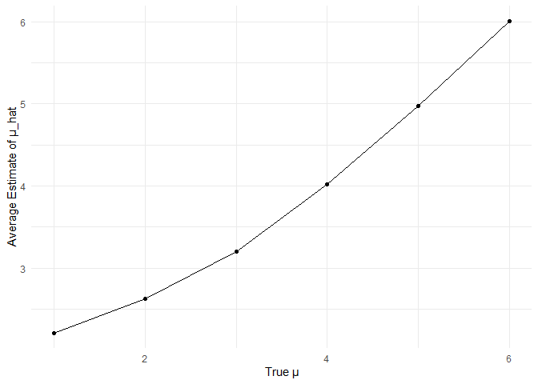
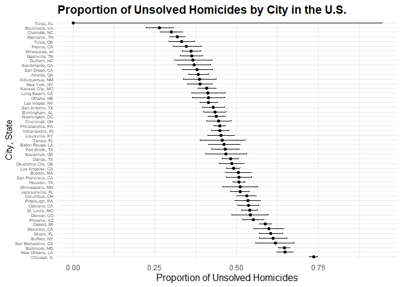

Homework 5
================

Set- up

``` r
library(tidyverse)
```

    ## ── Attaching core tidyverse packages ──────────────────────── tidyverse 2.0.0 ──
    ## ✔ dplyr     1.1.4     ✔ readr     2.1.5
    ## ✔ forcats   1.0.0     ✔ stringr   1.5.1
    ## ✔ ggplot2   3.5.1     ✔ tibble    3.2.1
    ## ✔ lubridate 1.9.3     ✔ tidyr     1.3.1
    ## ✔ purrr     1.0.2     
    ## ── Conflicts ────────────────────────────────────────── tidyverse_conflicts() ──
    ## ✖ dplyr::filter() masks stats::filter()
    ## ✖ dplyr::lag()    masks stats::lag()
    ## ℹ Use the conflicted package (<http://conflicted.r-lib.org/>) to force all conflicts to become errors

### **Problem 2**

First set the following design elements:

Fix n=30 Fix σ=5

Set μ=0 and generate 5000 datasets from the model: x∼Normal\[μ,σ\].
Also, save mu and p-value arising from a test of H: mu = 0 and alpha =
0.05.

``` r
gen_p2 = function(n = 30, mu =  0, sigma = 5) {
  gen_data = tibble(
    x = rnorm(n, mean = mu, sd = sigma),
  )
  
  test_result = t.test(gen_data$x, mu = 0)
  tidy_result = broom::tidy(test_result)
  
  gen_data |>
    summarize(
      mu_hat = mean(x),
      sigma_hat = sd(x),
      p_value = tidy_result$p.value
    )
}

output = vector("list", 5000)

for (i in 1:5000) {
  output[[i]] = gen_p2(30)
}

gen_results = bind_rows(output)
```

Repeat the above for mu = 1-6

``` r
new_mus = c(1,2,3,4,5,6)

all_results = list()

for (mu in new_mus) {
  output = vector("list", 5000) 

  for (i in 1:5000) {
    output[[i]] = gen_p2(30, mu = mu)
  }
  
  gen_results = bind_rows(output)
  
   gen_results$mu = mu
   
    all_results[[as.character(mu)]] = gen_results
}

tot_results = bind_rows(all_results)
```

PLOT: showing the proportion of times the null was rejected and the true
value of mu.

``` r
tot_results = tot_results %>%
  mutate(
    rejection = p_value < 0.05
  )

rejection_proportion = tot_results %>%
  group_by(mu) %>%
  summarize(
    rejection_rate = mean(rejection)
  )

ggplot(rejection_proportion, aes(x = mu, y = rejection_rate)) +
  geom_line() + 
  geom_point() +
  labs(
    x = "True μ",
    y = "Proportion of Rejections",
  ) +
  theme_minimal()
```

<!-- -->
Describe the association between effect size and power:  
Based on the graph above, the power of the test increases as the true
value of mu increases. Therefore, we can see a positive relationship
between the true value of mu and power however, it does level off betwen
mu = 5 and mu = 6.

PLOT: The average estimation of mu_hat and the true value of mu.

``` r
avg_mu_hat = tot_results %>%
  group_by(mu) %>%
  summarize(
    avg_mu_hat = mean(mu_hat)
  )

ggplot(avg_mu_hat, aes(x = mu, y = avg_mu_hat)) +
  geom_line() +
  geom_point() +
  labs(
    x = "True μ", 
    y = "Average Estimate of μ_hat"
  ) +
  theme_minimal()
```

<!-- -->
PLOT: Average estimate of mu_hat only in samples for which the null was
rejected.

``` r
avg_mu_hat_rejected = tot_results %>%
  filter(rejection == TRUE) %>%
  group_by(mu) %>%
  summarize(
    avg_mu_hat_rejected = mean(mu_hat)
  )

ggplot(avg_mu_hat_rejected, aes(x = mu, y = avg_mu_hat_rejected)) +
  geom_line() + 
  geom_point() +
  labs(
    x = "True μ", 
    y = "Average Estimate of μ_hat"
  ) +
  theme_minimal()
```

<!-- --> Is
the sample average of μ_hat across tests for which the null is rejected
approximately equal to the true value of μ? Why or why not? The sample
average of μ_hat across tests for which the null is rejected is not
approximately equal to the true value of μ. Based on the graph, the
sample averages of μ_hat = 2, 3, and 4 are more than the true value of
μ. For example, in the first graph, we see that the average estimated
μ_hat = 2 has a true value of μ =2, however in the bottom graph the
average estimated μ_hat = 2 has a true value of μ = ~2.2.

Therefore, the sample average of μ_hat across tests for which the null
is rejected is larger than the true value of μ and therefore they are
not approximately equal.

But, for the sample average of μ_hat = 5 and 6, the null is rejected is
approximately equal to the true value of μ.

### **Problem 3**

Import data

``` r
library(readr)
library(dplyr)

URL = "https://raw.githubusercontent.com/washingtonpost/data-homicides/refs/heads/master/homicide-data.csv"

wp_data = read_csv(URL, show_col_types = FALSE)
```

Describe the raw data:  
The Washington Post data describes homicides in 50 large U.S. cities.
There are 52,179 observations and 12 variables. The data includes victim
information including name, age, race, and sex. The data also includes
information about the homicide, such as reported date, city, state, and
disposition (stating if the case is open or closed and if there was or
was not an arrest).

Creating city_state variable

``` r
wp_data = wp_data %>%
  mutate(city_state = paste(city, state, sep = ", "))
```

Summarize within cities to obtain the total number of homicides and the
number of unsolved homicides.

``` r
wp_summary = wp_data %>%
  group_by(city_state) %>%
  summarize(
    total_homicides = n(),
    unsolved_homicides = sum(disposition %in% c("Closed without arrest", "Open/No arrest"), na.rm = TRUE)
  )
```

For Baltimore, MD, use the prop.test function to estimate the proportion
of homicides that are unsolved.

``` r
baltimore_data = wp_data %>%
  filter(city_state == "Baltimore, MD")

unsolved_count = sum(baltimore_data$disposition %in% c("Closed without arrest", "Open/No arrest"), na.rm = TRUE)
total_count = nrow(baltimore_data)

prop_test_result = prop.test(unsolved_count, total_count)

prop_test_tidy = broom::tidy(prop_test_result)

estimated_proportion = prop_test_tidy$estimate
CI_lower = prop_test_tidy$conf.low
CI_upper = prop_test_tidy$conf.high

print(estimated_proportion)
```

    ##         p 
    ## 0.6455607

``` r
print (CI_lower)
```

    ## [1] 0.6275625

``` r
print (CI_upper)
```

    ## [1] 0.6631599

Run prop.test for each of the cities in the database and extract both
the proportion of unsolved homicides and the CI for each. ***CHECK***

We run becuase you’re not getting the confidence intervals

``` r
library(dplyr)
library(tidyr)
library(purrr)

run_prop_test = function(unsolved, total) {
  if (total == 0) {
    return(list(proportion  = NA, CI_low = NA, CI_high = NA))
  }
  
  test_result = prop.test(unsolved, total, correct = TRUE)
  
  list(
    proportion  = test_result$estimate,
    CI_low = test_result$conf.int[1],
    CI_high = test_result$conf.int[2]
  )
}

wp_city_results = wp_data %>%
  group_by(city_state) %>%
  summarize(
    total_homicides = n(),
    unsolved_homicides = sum(disposition %in% c("Closed without arrest", "Open/No arrest"), na.rm = TRUE),
    .groups = "drop"
  ) %>%
  mutate(
    results = purrr::map2(unsolved_homicides, total_homicides, run_prop_test)
  ) %>%
  unnest_wider(results) %>%
  # Select only the relevant columns: city_state, unsolved_homicides, and the CI
  select(city_state, unsolved_homicides, proportion, CI_low, CI_high)
```

    ## Warning: There was 1 warning in `mutate()`.
    ## ℹ In argument: `results = purrr::map2(unsolved_homicides, total_homicides,
    ##   run_prop_test)`.
    ## Caused by warning in `prop.test()`:
    ## ! Chi-squared approximation may be incorrect

``` r
# Print the cleaned up results
print(wp_city_results)
```

    ## # A tibble: 51 × 5
    ##    city_state      unsolved_homicides proportion CI_low CI_high
    ##    <chr>                        <int>      <dbl>  <dbl>   <dbl>
    ##  1 Albuquerque, NM                146      0.386  0.337   0.438
    ##  2 Atlanta, GA                    373      0.383  0.353   0.415
    ##  3 Baltimore, MD                 1825      0.646  0.628   0.663
    ##  4 Baton Rouge, LA                196      0.462  0.414   0.511
    ##  5 Birmingham, AL                 347      0.434  0.399   0.469
    ##  6 Boston, MA                     310      0.505  0.465   0.545
    ##  7 Buffalo, NY                    319      0.612  0.569   0.654
    ##  8 Charlotte, NC                  206      0.300  0.266   0.336
    ##  9 Chicago, IL                   4073      0.736  0.724   0.747
    ## 10 Cincinnati, OH                 309      0.445  0.408   0.483
    ## # ℹ 41 more rows

PLOT: Estimates and CIs for each city ***CHECK***

``` r
library(ggplot2)
library(dplyr)

wp_city_results <- wp_city_results %>%
  arrange(desc(proportion)) %>%
  mutate(city_state = factor(city_state, levels = city_state))

ggplot(wp_city_results, aes(x = city_state, y = proportion)) +
  geom_point() +
  geom_errorbar(aes(ymin = CI_low, ymax = CI_high), width = 0.2) +
  coord_flip() +  # Flip coordinates for better readability
  labs(
    title = "Proportion of Unsolved Homicides by City in the U.S.",
    x = "City, State",
    y = "Proportion of Unsolved Homicides"
  ) +
  theme_minimal() +
  theme(
    axis.text.y = element_text(size = 5),
    axis.title.x = element_text(size = 12),
    plot.title = element_text(size = 14, face = "bold")
  )
```

<!-- -->
